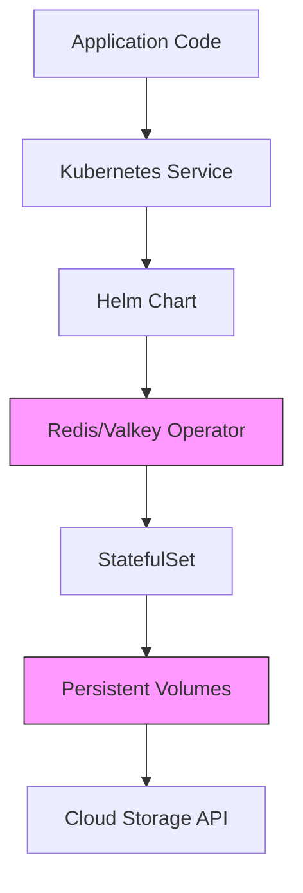

## Opening Hook

At 3 AM, when your payment processing system goes down, the question isn't whether you're running Redis or Valkey. It's whether anyone in your organization actually understands how the cache layer interacts with the service mesh, which orchestrates containers that pull images from registries that depend on... you get the picture.

The real risk in modern infrastructure isn't any single component—it's the dependency graph we've built without understanding its failure modes. Redis vs Valkey is a distraction from the actual problem: **we've created systems so abstract that when they fail, nobody knows why.**

I've sat in incident war rooms where ten senior engineers stared at monitoring dashboards, each one an expert in their layer but collectively clueless about how the layers interacted. That's not resilience—that's distributed ignorance.

## Main Thesis

Infrastructure fragility comes not from choosing the "wrong" technology, but from accumulating layers of indirection that obscure operational reality. Each abstraction promises to reduce complexity but often just concentrates it differently. The Redis licensing change served as a forcing function to examine dependencies we already had—dependencies that matter far more than any single component's license.

The uncomfortable truth: **We've built infrastructure dependency pyramids where the foundation is made of other people's assumptions.** We add layers faster than we understand what we've already built.

## Technical Analysis

Consider a typical modern stack for a web application:

This looks clean. It's not clean. Each layer introduces coupling that becomes invisible until failure:

1. **Operational coupling**: Helm charts version-lock you to specific CRDs and operational patterns
2. **Knowledge coupling**: Nobody understands the full stack end-to-end anymore
3. **Vendor coupling**: Cloud storage APIs create implicit lock-in that's impossible to test locally
4. **Community coupling**: Operators depend on upstream project health and maintainer availability
5. **Temporal coupling**: Dependencies change independently, creating version matrix hell

Here's the uncomfortable truth: **Kubernetes often shifts complexity instead of removing it.** It makes infrastructure declarative and version-controlled, but it mystifies operational knowledge. You can `kubectl diff` your changes, but you can't `kubectl understand` the implications.

## Production Examples and Scenarios

**Scenario 1: The Helm Black Box**

A streaming company adopted the official Redis Helm chart for Valkey deployment. When performance degraded during peak traffic, their team spent three weeks debugging. They looked at:
- Kubernetes resource limits and requests
- Helm template rendering issues  
- The operator's reconciliation loop timing
- Network policies between pods
- Underlying EC2 instance types and NUMA topology

Turned out: EBS volume provisioning was throttled due to account-level IOPS limits they didn't know existed. The Helm chart worked perfectly—it just couldn't know about AWS account restrictions buried in the cloud console. The abstraction hid the constraint until it became a production problem.

**Scenario 2: The Operator Illusion**

A fintech startup adopted the Redis operator expecting "automatic management." They gained operability but lost visibility. When the operator failed to handle a network partition correctly during a cloud region degradation, their "managed" service became an operational black hole. Recovery required understanding both Redis internals AND the operator's control loop implementation—knowledge distributed across GitHub repositories and Slack channels.

They had outsourced their operational knowledge to a community project. When it failed, they were operating at the skill level of their least knowledgeable engineer, not their most.

**Scenario 3: The Foundation Dependency**

A gaming company chose Valkey specifically for Linux Foundation governance, believing this provided "stability." When a critical memory leak emerged in Valkey 7.2.1, they discovered:
- No commercial support channels for the version they ran
- Volunteer-driven issue triage with week-long response times
- Their "enterprise" support actually came from a third-party vendor with limited Valkey experience
- The foundation's governance didn't translate to operational SLAs

The foundation provided governance, not operational reliability. Critical distinction.

## Operational Tradeoffs

The real tradeoff matrix looks very different from typical comparisons:

| Tradeoff | The Promise | The Reality |
|----------|-------------|-------------|
| Abstraction | Simpler operations | Increased knowledge debt |
| Standardization | Easier hiring | Hidden expertise requirements |
| Automation | Reduced incidents | More complex recovery |
| Community Support | Faster fixes | Dependency on maintainer availability |
| Foundation Governance | Stability | Operational gaps |

Here's a contrarian insight: **Open-source governance does not guarantee operational simplicity.** Valkey may have a foundation behind it, but your team still needs to operate it at 3 AM when the pager goes off. Governance is about decision-making process, not operational capability.

## Pull Quotes

> "We replaced Redis with Valkey and gained a new set of problems we didn't know how to solve." — SRE team lead

> "Every abstraction layer is a knowledge hiding layer until it becomes a failure surface." — Infrastructure observations

> "The operator managed our Redis cluster perfectly, right up until it couldn't, and then nobody knew how to take over manually." — Post-mortem notes

> "We optimized for deployment simplicity and accidentally optimized for operational complexity." — Engineering director

## Dependency Concentration Risk

Modern infrastructure creates risk concentration through several mechanisms:

1. **Template Concentration**: Organizations standardize on a few Helm charts, Terraform modules, or operators, creating single points of failure
2. **Cloud Service Concentration**: Heavy use of managed services concentrates risk in cloud provider regions and APIs
3. **Community Concentration**: Reliance on a handful of popular open-source projects means incidents affect thousands simultaneously
4. **Knowledge Concentration**: Expertise becomes concentrated in a few senior engineers who understand the full stack

When any of these concentrations fails, the blast radius extends far beyond what traditional failure analysis would predict.

## Summary

The dependency graph in modern infrastructure creates risk concentration that no amount of open-source licensing can address. Valkey vs Redis is a false dichotomy when you're locked into Kubernetes operators, Helm charts, and cloud provider APIs that nobody fully understands.

The real work isn't migrating between compatible systems—it's building operational expertise that transcends individual technology choices. But operational expertise is expensive and hard to scale, so we keep adding abstractions instead.

## Production Consequences

The abstraction layers create several negative outcomes:
1. **Blameless debugging becomes impossible** when failure spans multiple teams' responsibilities
2. **On-call effectiveness degrades** as engineers can't understand their own systems
3. **Recovery time increases** because diagnosis requires understanding multiple layers
4. **Risk concentration grows** as more systems share the same abstraction stack

These aren't theoretical—they're measurable impacts on MTTR and system reliability.

## Closing Thought

When you can't explain your infrastructure stack to a new hire in two hours, you've got a dependency problem—not a technology problem.

*Next: We'll explore who should actually own critical infrastructure decisions and whether open-source foundations provide the governance we think they do.*