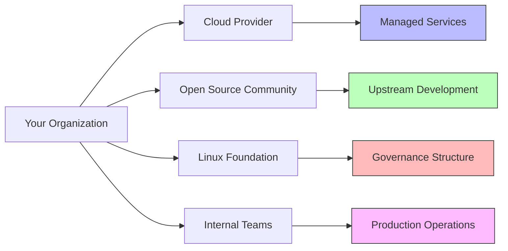

## Opening Hook

Who controls your Redis cluster at 3 AM? Is it you—the person paged for the outage? Or is it the cloud provider who runs the managed service? The foundation that hosts the open-source project? The community that maintains the issue tracker?

Spoiler: It's probably none of these. It's the collective accident of decisions made by people who've never met, working for organizations with misaligned incentives, writing code your team deploys without fully understanding. This isn't infrastructure management—this is infrastructure gambling.

I've watched organizations bet their uptime on foundations they've never contributed to, maintainers they've never met, and governance models they've never analyzed. The house always wins.

## Main Thesis

Valkey vs Redis isn't a technical debate—it's a governance and control debate about who owns critical production infrastructure. The move to the Linux Foundation represents hope that open-source stewardship equals operational autonomy. But **hope isn't a strategy**, and foundation governance doesn't magically solve the fundamental tension between convenience and control in modern infrastructure.

The uncomfortable truth: **We've optimized for deployment velocity while externalizing operational responsibility.** This creates a governance gap where nobody truly owns the consequences of infrastructure failures.

## Technical Analysis

Let's examine where control actually resides:

The uncomfortable reality: **Your organization likely controls less infrastructure than you think.** Cloud-managed services shift operational burden but concentrate decision-making power. Open-source contributions democratize development but require organizational commitment to be meaningful.

Let's challenge a sacred cow: **API compatibility does not guarantee operational compatibility.** Valkey speaks Redis protocol, but does your team know how to debug its eviction policies? Tune its replication settings? Recover from its specific failure modes? The API lies—it suggests familiarity while hiding uniqueness.

I've seen teams confidently migrate to Valkey because "it's compatible" only to discover that memory fragmentation behaves differently, persistence tuning has different parameters, and community support follows different timelines. Compatibility is a spectrum, not a boolean.

## Production Examples and Scenarios

**Scenario 1: The Foundation Fallacy**

A retail company chose Valkey specifically for Linux Foundation governance, believing this provided "stability." When a critical bug emerged in Valkey 7.2.1 affecting their peak season traffic, they discovered:
- No commercial support channels for the version they ran
- Volunteer-driven issue triage with week-long response times
- Their "enterprise" support actually came from a third-party vendor with limited Valkey experience
- The foundation's governance didn't translate to operational SLAs

Their takeaway: **Open-source governance does not equal operational reliability.** The foundation provided decision-making process, not incident response capability. They had outsourced their operational risk to a governance structure optimized for technical direction, not production support.

**Scenario 2: The Cloud Convenience Trap**

A healthcare startup built on AWS ElastiCache (Redis-compatible) for speed-to-market. As they scaled, they discovered:
- No visibility into underlying configurations or performance tuning options
- Vendor-specific extensions that prevented migration (CloudWatch metrics format, IAM integration patterns)
- Pricing tied to proprietary scaling metrics that made cost prediction impossible
- Support tickets that went to general cloud queues, not database experts

Migration became a multi-million dollar project, not because of code incompatibility, but because of operational lock-in they hadn't considered. They had accidentally built their scaling strategy around vendor-specific capabilities that didn't exist elsewhere.

**Scenario 3: The Hybrid Hope**

A financial services company thought they'd solved everything by running Valkey on their own infrastructure but contributing back to the Linux Foundation project. They discovered:
- Contributing required significant engineering time away from business features
- Their contributions were often architectural directions the community didn't want
- Operational responsibility still rested entirely with them
- They were paying twice: once for infrastructure and once for contribution time

The hybrid approach gave them neither the control they wanted nor the convenience they needed.

## Operational Tradeoffs

The fundamental tension in infrastructure control:

| Model | Control | Convenience | Risk |
|-------|---------|-------------|------|
| Self-hosted Open Source | High | Low | Expertise debt |
| Foundation Governance | Medium | Medium | Community sustainability |
| Cloud Managed Services | Low | High | Vendor lock-in |
| Hybrid Approach | Variable | Variable | Integration complexity |

Here's the uncomfortable truth: **Migration projects often increase organizational risk.** Every time we switch platforms claiming "freedom," we're actually taking on new forms of dependency we don't yet understand. The migration itself is often more risky than staying put.

I've observed that organizations with stable, well-operated Redis installations rarely benefit from switching to Valkey. The organizations that gain value are those that needed to build operational capability anyway—and the migration forces them to do it.

## Pull Quotes

> "We thought the Linux Foundation meant stability. It meant community-driven uncertainty instead." — Engineering director

> "Cloud providers sell convenience, then charge for escape velocity." — Infrastructure economics observation

> "Benchmark performance doesn't matter when you're debugging a production incident at 3 AM." — Hard-won wisdom

> "We optimized for not managing infrastructure and accidentally optimized for not understanding it." — SRE team lead

> "The foundation gave us a seat at the table but not a voice in the conversation." — Contributing organization lead

## Control Distribution Analysis

The key insight: **Control over infrastructure follows contribution, not consumption.** Organizations that contribute code, documentation, or funding to open-source projects gain proportional influence over direction. Organizations that just consume get to vote with their feet—but only after the fact.

This creates a governance paradox:
- **To have control, you must invest upfront**
- **To invest upfront requires certainty about direction**  
- **To have certainty requires control**

Most organizations want the benefits without the investment, leading to the governance gap we see in practice.

## Summary

The Valkey vs Redis debate exposes how infrastructure decisions are actually about control distribution, not technology features. Whether you choose foundation-governed Valkey or commercially-backed Redis, you're making a bet about who should own critical operational knowledge.

The real choice isn't between technologies—it's between accepting vendor influence, community governance, or building internal capability. Each path has tradeoffs that licensing rarely addresses.

The organizations that thrive are those who make intentional choices about control distribution rather than accidental ones driven by industry narratives.

## Production Consequences

The governance gap creates several negative outcomes:
1. **Incident response delays** when nobody truly owns the problem
2. **Feature stagnation** when consumers can't influence direction
3. **Operational brittleness** when knowledge remains external
4. **Strategic drift** when roadmap priorities don't match business needs

These aren't hypothetical—they're the root cause of countless production outages and architectural regrets.

## Final Reflection

The ultimate question isn't "Which cache should we use?" It's "What kind of infrastructure relationship do we want?" Do you want to rent convenience, subscribe to support, or build capability? Each choice concentrates different forms of power—and risk—in different hands.

Until we acknowledge that infrastructure decisions are fundamentally about governance and control, we'll keep solving technical problems that aren't actually technical at all.

The next time a licensing debate erupts, look past the code to the real question: **Who controls your production destiny?** And more importantly: Do they even know they do?